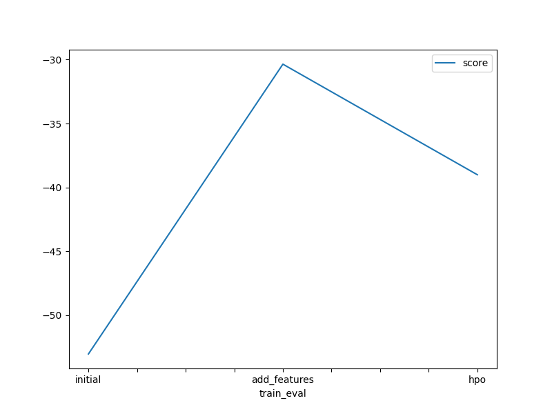
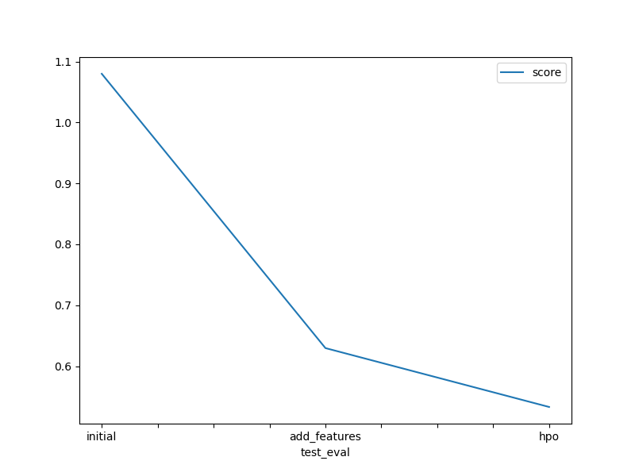

# Report: Predict Bike Sharing Demand with AutoGluon Solution
#### NAME: ABDELRAHMAN DARWISH

## Initial Training
### What did you realize when you tried to submit your predictions? What changes were needed to the output of the predictor to submit your results?
Using "predictor.fit_summary()" it is observed that "WeightedEnsemble_L3" model performed the best among other 13 models during training. After testing the model a table of predictions is created, however in order to be able to submit the predictions values below zero should be eleminated, this is performed by setting negative values to zero. A submission file is created with two colummns, "datetime" and "count". The result of the submission was a score of 1.80008. Root mean squared is the metric used.

### What was the top ranked model that performed?
"WeightedEnsemble_L3" model performed the best among other 13 models during training.

## Exploratory data analysis and feature creation
### What did the exploratory analysis find and how did you add additional features?
Exploratory data analysis is performed by creating a histogram of the datset. The histogram showed presence of 11 features, two of which are categorical data. The "dtetime" feature showed to be complex and to for it to better help the model perform better it was separated into three other features, month, day and hour.

### How much better did your model preform after adding additional features and why do you think that is?
The model performance showed significant improve from a RMS of 1.80008 to 0.62966. This can be addressed to the fact that additional features are added. Adding features provide a richer representation of the data as well as it might directly contain information relevant to the target variable.

## Hyper parameter tuning
### How much better did your model preform after trying different hyper parameters?
Model performance improvement was not significant. Trying different hyperparameters the model was able to reach a RMS of 0.53297.

### If you were given more time with this dataset, where do you think you would spend more time?
I wouls spend more time trying to understand relevance of different features to the target. Data preprocessing is an important and crucial part of training a high performance model.

### Create a table with the models you ran, the hyperparameters modified, and the kaggle score.
|model|hpo1|hpo2|hpo3|score|
|--|--|--|--|--|
|initial|None|None|None|1.8008|
|add_features|None|None|None|0.62966|
|hpo|'num_boost_round': 100|'num_epochs': 10|'learning_rate':0.0001|0.53297|

### Create a line plot showing the top model score for the three (or more) training runs during the project.

TODO: Replace the image below with your own.

### Create a line plot showing the top kaggle score for the three (or more) prediction submissions during the project.

TODO: Replace the image below with your own.

## Summary
AutoGluon was utilized in this project to forecast bike rental demand. Initially, a baseline model was trained, yielding a score of 1.80008. To enhance the model's performance, exploratory data analysis and feature engineering were employed, revealing temporal patterns in rental demand. Integration of these new features significantly boosted the model's performance, resulting in a score of 0.62966. Additionally, hyperparameter tuning was utilized to refine the model's settings, further improving predictive accuracy to 0.53297. The iterative refinement of the model and feature engineering led to substantial enhancements in predictive performance. Looking ahead, continued refinement and experimentation with diverse modeling techniques and feature engineering methods could yield even better results. In summary, this project underscores AutoGluon's efficacy in constructing precise predictive models for intricate datasets such as bike sharing demand.

